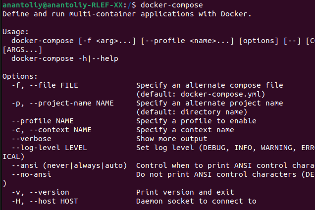
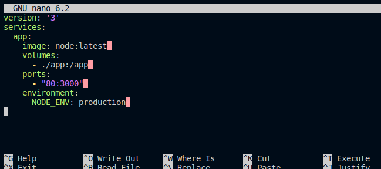
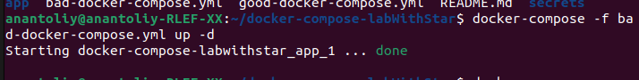
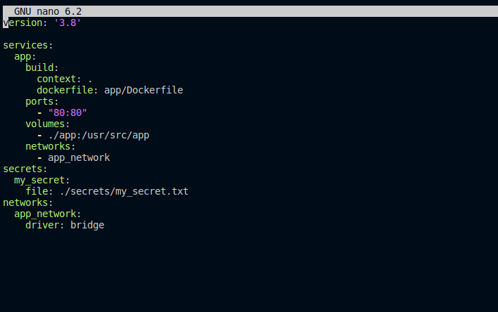
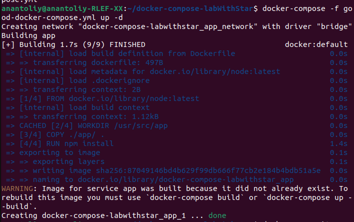

# это лаба 2 со звездой
## Что надо:
* Написать “плохой” Docker compose файл, в котором есть не менее трех “bad practices” по их написанию
* Написать “хороший” Docker compose файл, в котором эти плохие практики исправлены
* В Readme описать каждую из плохих практик в плохом файле, почему она плохая и как в хорошем она была исправлена, как исправление повлияло на результат
* После предыдущих пунктов в хорошем файле настроить сервисы так, чтобы контейнеры в рамках этого compose-проекта так же поднимались вместе, но не "видели" друг друга по сети. В отчете описать, как этого добились и кратко объяснить принцип такой изоляции
# Подготовка
### установка docker-compose.

docker-compose уже установлен
# Делаем докерфайлы
### плохой

### хороший

## Что не так:
* В бэд файле используется одна общая сеть для всех контейнеров, это бэд бикос нурашает принцип изоляции.
* Использование latest вместо указания версии, в новой версии все может поменятся - было во второй лабе 
* в плохом файле не секретов, ссылаться на гораздо безопаснее
# Сеть
### Добился изоляции, создав для сервиса уникальную сеть с драйвером bridge, это обеспечилр сетевую изоляцию, так как теперь сервисы подключены только к своим сетям, и поэтому они не взаимодейсвуют друг с другом.

